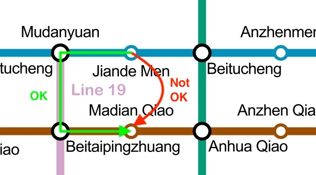
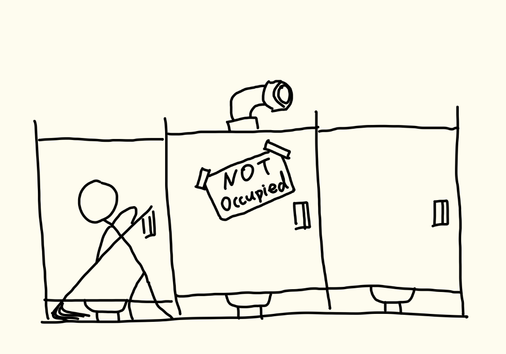

# Subway Challenge: Beijing Edition

Beijing Subway is currently (late 2026) the longest subway system in the world, with 909 kilometers (565 miles) of tracks in total. You can get on line 5, take an hour long nap, and wake up on the other end of the city, still many stops away from the terminus. I love its scale and reach, so I decided to embark on a project to try to visit every single one of its stations in one day.

## Rules

First, the rules of the challenge. It turns out, I am not the first person to try to speedrun a metro system! [Subway Challenge](https://en.wikipedia.org/wiki/Subway_Challenge) (Class B in particular) is an 80 years old challenge where participants speedrun the entire New York subway system (MTA). I will be borrowing heavily from their rules.

I am allowed to start and end a run at any metro station, and I do *not* have to start and end at the same metro station. During a run, I am allowed to board / unboard trains and transfer between lines as much as I want. However, I am not allowed to exit and reenter the metro system to take a shortcut by car / bike / rocket (Thankfully all line transfers can be done without leaving the station). In other words, the run must be done with a single one-way ticket. 

Unfortunately for me (and fortunately for the subway workers), the Beijing Subway is not open 24 hours like the MTA. On most lines, the first trains depart from the termini at around 5:30 AM, and the last trains depart at around 11:30 PM. Once the last train has departed from a station, it will be cleared and closed for the night. This means that excluding extreme strategies like hiding in the bathroom, I will have a hard time bound of approximately 18 hours (the last train *leaves* at 11:30 PM, so stations on longer lines may not close for another hour).

What this means is that visiting ALL 541 stations of the Beijing Subway in one run is almost certainly impossible. With significantly more length and more stations than the MTA, visiting every station of the Beijing Subway would almost certainly take more time than visiting every station of MTA, and the current record of the MTA Subway Challenge is [just over 24 hours](https://en.wikipedia.org/wiki/Subway_Challenge#472_stations), held by Kate Jones, already far over our 18 hour limit.

Therefore, we will change our objective slightly. Instead of visiting all stations in the shortest time possible, our goal would be to visit as many different stations as possible in a single run - a single day. From an optimization perspective, we are attempting the *dual* of the original challenge.

Lastly, we need to define what counts as visiting a station. Borrowing from MTA rules, I will count a station as visited if the train I am on stops at it. If I take a [skip-stop](https://en.wikipedia.org/wiki/Skip-stop) train that flies through a station without stopping, that does not count as visiting it. On the flip side, I do not have to physically disembark and step in a station to visit it. This is for practical reasons, so that I do not lose my hard-fought seat on a rush hour train, or worse, not be able to squeeze back onto the packed train.

